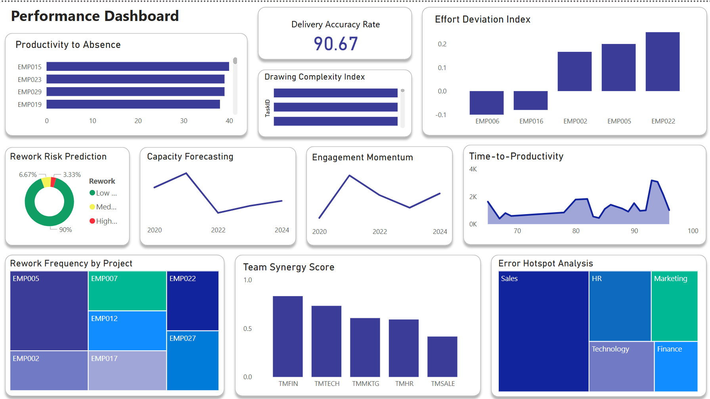

# 💼 HR + Performance Dashboard | Power BI Project


## 📊 Project Overview

This Power BI project is a **comprehensive HR + Performance dashboard** built to help organizations monitor employee metrics, track performance trends, and make smarter workforce decisions through data.

Designed for **HR teams, management, and data analysts**, this dashboard blends traditional HR analytics with **advanced performance KPIs** and **predictive insights**.

---

## 🚀 Features & Highlights

### ✅ **HR Dashboard Section**
- 📌 **KPIs**:  
  - Total Employees  
  - Average Salary  
  - Absence Rate  
  - Average Tenure  
  - Attrition Rate  

- 📊 **Visuals**:  
  - Tenure Distribution  
  - Performance by Department  
  - Salary by Designation  
  - Employee Status (Active / Terminated)
  - Dynamic Employee Table with E-ID, Role, Salary, Tenure

- 🎛 **Slicers**:  
  - Location  
  - Department  
  - Designation  
  - Performance Rating

---

### ✅ **Performance Dashboard Section**
- 📌 **Advanced KPIs & Predictive Models**:  
  - Productivity vs. Absenteeism  
  - Effort Deviation Score  
  - Delivery Accuracy %  
  - Drawing Complexity Index  
  - Rework Frequency by Project  
  - Rework Risk Prediction (Low/Medium/High)
  - Capacity Forecasting  
  - Time to Productivity (for new hires)  
  - Engagement Trendline  
  - Team Synergy Score  
  - Error Hotspot Treemap

- 📈 **Forecasts + Scatter Charts** for Risk & Planning
- 🎯 Insightful storytelling with dynamic filters

---

## 🛠️ Tools & Technologies

- Power BI Desktop  
- DAX (Data Analysis Expressions)  
- Excel / CSV Data Sources  
- Data Modeling  
- Predictive Trendlines  
- Interactive Visuals (Cards, Maps, Treemaps, Scatter Charts)

---

## 📸 Dashboard Previews

> *(Replace the links below with your screenshots or YouTube video)*

| HR Dashboard | Performance Dashboard |
|--------------|------------------------|
|  |  |

---

## 📁 File Structure

```bash
📁 HR-Performance-Dashboard/
├── 📊 HR_Dashboard.pbix
├──  employees_data.csv
├── 📸 Screenshots/
│   └── HR.png
|   └── Performance.png
└── 📄 README.md
